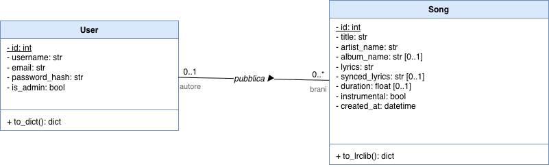
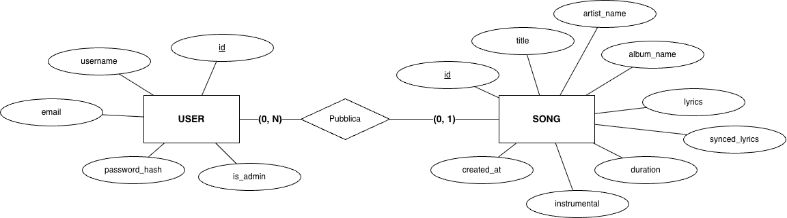

# Stopify — Relazione Tecnica

Sistema per la raccolta e consultazione di **lyrics musicali** (testi piani e sincronizzati) compatibile con la specifica [LRCLIB](https://lrclib.net/docs).

> **Corso:** Architettura, Reti e Sicurezza — A.A. 2025/2026
> **Studenti:** Matteo Barbieri, Ludovico Colussi, Francesco Martinelli
> **Università:** Università degli Studi del Piemonte Orientale — Corso di Laurea Intelligenza Artificiale e Innovazione Digitale

---

## Indice

1. [Obiettivi del progetto](#1-obiettivi-del-progetto)
2. [Specifiche funzionali](#2-specifiche-funzionali)
3. [Stack tecnologico](#3-stack-tecnologico)
4. [Architettura del sistema](#4-architettura-del-sistema)
5. [Schema del database](#5-schema-del-database)
6. [API REST](#6-api-rest)
7. [Autenticazione e Proof of Work](#7-autenticazione-e-proof-of-work)
8. [Sicurezza](#8-sicurezza)
9. [Setup e avvio](#9-setup-e-avvio)
10. [Struttura del repository](#10-struttura-del-progetto)

---

## 1. Obiettivi del progetto

Stopify nasce con l'obiettivo di implementare un sistema distribuito client-server per la gestione di lyrics musicali, che rispetti la specifica open-source **LRCLIB**. Il progetto copre in modo integrato i temi centrali del corso:

---

## 2. Specifiche funzionali

Il sistema è composto da due componenti principali:

- **Backend Flask** (`Backend/`) — server REST con persistenza SQLite
- **App Mobile Expo / React Native** (`MobileApp/`) — client iOS / Android / Web

### Requisiti funzionali

Il backend implementa l'intera specifica LRCLIB richiesta dalla traccia del progetto,
oltre a ulteriori API per la gestione degli accessi e del ruolo admin:

| # | Funzionalità | Endpoint | Metodo |
|---|---|---|---|
| RF1 | Lookup lyrics per signature (titolo + artista) | `GET /api/get` | GET |
| RF2 | Lookup lyrics (solo cache locale) | `GET /api/get-cached` | GET |
| RF3 | Lookup lyrics per ID | `GET /api/get/<id>` | GET |
| RF4 | Ricerca full-text nel catalogo | `GET /api/search` | GET |
| RF5 | Pubblicazione di nuove lyrics | `POST /api/publish` | POST |
| RF6 | Richiesta challenge Proof of Work | `POST /api/request-challenge` | POST |
| RF7 | Registrazione e autenticazione utente | `/auth/register`, `/auth/login` | POST |
| RF8 | Lista brani pubblicati dall'utente autenticato | `GET /api/me/songs` | GET |
| RF9 | Modifica di un proprio brano | `PUT /api/songs/<id>` | PUT |
| RF10 | Cancellazione di un proprio brano | `DELETE /api/songs/<id>` | DELETE |
| RF11 | Vista admin: catalogo completo con filtri | `GET /admin/songs` | GET |

### Requisiti non funzionali

- **Sicurezza**: password hashed, JWT firmati con scadenza, PoW per le pubblicazioni anonime
- **Usabilità**: app mobile per ios o android, con gradienti e blur per un'interfaccia moderna
- **Portabilità**: backend eseguibile su qualsiasi sistema con Python ≥ 3.10; app testabile su simulatore o device fisico tramite expo go

---

## 3. Stack tecnologico

### Backend

| Componente | Tecnologia | Versione | Motivazione della scelta |
|---|---|---|---|
| Web framework | Flask | 3.1 | Leggero, flessibile, ottimo per API REST; ampia documentazione |
| ORM | Flask-SQLAlchemy | 3.1 | Astrazione sul DB, query parametrizzate (sicurezza SQL injection) |
| Database | SQLite | embedded | Semplice da deployare senza server separato; adatto al prototipo |
| Autenticazione | Flask-JWT-Extended | 4.7 | Gestione nativa di access token JWT con HS256 |
| Hashing password | werkzeug.security | — | PBKDF2-SHA256 con salt randomico, già incluso nell'ecosistema Flask |

### App Mobile

| Componente | Tecnologia | Versione | Motivazione della scelta |
|---|---|---|---|
| Framework UI | React Native | 0.81 | Unica codebase per iOS, Android e Web |
| Runtime | Expo SDK | 54 | Semplifica build, aggiornamenti OTA e accesso alle API native |
| Routing | expo-router | 6 | File-based routing, struttura chiara e manutenibile |

---

## 4. Architettura del sistema

### Vista ad alto livello

```
┌────────────────────┐         HTTPS / HTTP          ┌────────────────────┐
│   Mobile App       │◄─────────────────────────────►│   Flask Backend    │
│   (Expo / RN)      │       JSON over REST          │   (port 5000)      │
└────────────────────┘                               └─────────┬──────────┘
                                                               │
                                                          SQLAlchemy ORM
                                                               │
                                                     ┌─────────▼──────────┐
                                                     │  SQLite (file DB)  │
                                                     │   lyrics.db        │
                                                     └────────────────────┘
```

### Diagramma delle classi (modello di dominio)

Le entità principali del sistema e la loro associazione, in notazione UML:



> 📐 Sorgente editabile: [`class-diagram.drawio`](class-diagram.drawio) · [versione PDF](class-diagram.pdf)

### Architettura a strati del backend

Il backend è organizzato secondo il pattern *Routes → Services → Models*, che garantisce separazione delle responsabilità e testabilità della logica di business indipendentemente dal layer HTTP.

```
app/
├── routes/      ← Entrypoint HTTP: validazione payload, formattazione risposta
├── services/    ← Business logic: transazioni, eccezioni di dominio
├── models/      ← ORM models (SQLAlchemy): mapping tabelle ↔ oggetti Python
└── utils/       ← Helper trasversali: encoder LRC, funzioni di sicurezza
```

### Flusso di una richiesta tipica

```
Client HTTP
    │
    ▼
[Route] ── valida i parametri, autentica JWT (se richiesto)
    │
    ▼
[Service] ── esegue la business logic, interagisce con il DB
    │
    ▼
[Model] ── SQLAlchemy: query parametrizzate, gestione transazioni
    │
    ▼
[Route] ── formatta la risposta JSON, imposta lo status code
    │
    ▼
Client HTTP
```

---

## 5. Schema del database



> 📊 Sorgente editabile: [`ER.drawio`](db/ER.drawio) · [versione PDF](db/ER.pdf)

**Scelte progettuali:**

- `Song.user_id` è nullable per supportare il modello ibrido: valorizzato per brani pubblicati da utenti autenticati, `NULL` per brani anonimi (via PoW).
- `artist_name` e `album_name` sono memorizzati direttamente sulla tabella `songs` (modello piatto, coerente con la specifica LRCLIB) anziché in tabelle `artists`/`albums` separate: il sistema non prevede pagine artista/album né metadati dedicati, quindi la normalizzazione non porterebbe alcun vantaggio funzionale.
- `synced_lyrics` è memorizzato come stringa JSON (`[{"time": 12.5, "line": "..."}]`). La conversione bidirezionale con il formato LRC standard (`[mm:ss.xx] testo`) è gestita da `app/utils/lrc.py`, disaccoppiando il formato di storage da quello di trasporto.

---

## 6. API REST

Tutte le risposte sono JSON. Gli errori restituiscono un oggetto JSON con il campo `message`:

```json
{ "message": "Lyrics non trovate" }
```

Gli errori globali (404, 405, 500 non intercettati dalle route) usano il campo `error`:

```json
{ "error": "Risorsa non trovata" }
```

### Endpoint compatibili LRCLIB (`/api/*`)

#### `GET /api/get` — Lookup per signature

Cerca lyrics per titolo e artista; la durata è opzionale con tolleranza ±2s.

**Query parameters:** `track_name` (req), `artist_name` (req), `album_name` (opt), `duration` (opt, secondi)

**Risposta 200:**
```json
{
  "id": 2,
  "trackName": "Midnight Drive",
  "artistName": "Solar Static",
  "albumName": "Polar Lights",
  "duration": 198.0,
  "instrumental": false,
  "plainLyrics": "...",
  "syncedLyrics": "[00:00.00] ...\n[00:04.20] ...",
  "submittedBy": null
}
```

```bash
curl "http://localhost:5000/api/get?track_name=Midnight+Drive&artist_name=Solar+Static&duration=198"
```

#### `GET /api/get-cached` — Lookup (solo cache locale)

Identico a `/api/get`. Nella nostra implementazione i due endpoint coincidono perché il DB locale *è* la cache: non è previsto un fallback su sorgenti esterne.

#### `GET /api/get/<id>` — Lookup per ID

```bash
curl http://localhost:5000/api/get/1
```

#### `GET /api/search` — Ricerca full-text

Richiede almeno uno tra `q`, `track_name`, `artist_name`, `album_name`. Ritorna fino a 50 risultati.

```bash
curl "http://localhost:5000/api/search?q=midnight"
```

#### `POST /api/request-challenge` — Challenge PoW

Emette una nuova challenge.

**Risposta 200:**
```json
{
  "prefix": "0fbe285cf9198af4beffd38bc7b854ac085908422b68246e09052d8532f1dfb0",
  "target": "0000ffffffffffffffffffffffffffffffffffffffffffffffffffffffffffff"
}
```

#### `POST /api/publish` — Pubblicazione lyrics

Richiede **uno tra**:
- `Authorization: Bearer <jwt>` → pubblicazione attribuita all'utente (senza PoW)
- `X-Publish-Token: <prefix>:<nonce>` → pubblicazione anonima (PoW necessario)

**Body JSON:**
```json
{
  "trackName": "Demo Track",
  "artistName": "Demo Artist",
  "albumName": "Optional Album",
  "duration": 123.4,
  "plainLyrics": "First line\nSecond line",
  "syncedLyrics": "[00:00.00] First line\n[00:03.50] Second line",
  "instrumental": false
}
```

### Endpoint di autenticazione (`/auth/*`)

| Endpoint | Body / Header | Risposta |
|---|---|---|
| `POST /auth/register` | `{username, email, password}` | `{user, accessToken}` |
| `POST /auth/login` | `{usernameOrEmail, password}` | `{user, accessToken}` |
| `GET  /auth/me` | `Authorization: Bearer <accessToken>` | `{user}` |

**Validazione registrazione:**
- `username` — `^[A-Za-z0-9_]{3,30}$`
- `email` — formato standard, normalizzata in lowercase
- `password` — minimo 8 caratteri, almeno una cifra
- Username ed email univoci (case-insensitive)

### Endpoint estensioni app (sotto `/api/*`)

| Endpoint | Descrizione |
|---|---|
| `GET /api/health` | Health-check del server |
| `GET /api/explore?page=&limit=&sort=` | Catalogo paginato (`recent` / `title` / `artist`) |

---

## 7. Autenticazione e Proof of Work

### Modello ibrido

La pubblicazione di lyrics supporta due flussi distinti, permettendo sia utenti registrati che anonimi nel rispetto della specifica LRCLIB:

```
┌─ Utente loggato ─────────► JWT (Bearer) ──► /api/publish ──► song con submittedBy
│
└─ Utente anonimo ──► PoW challenge ──► nonce ──► X-Publish-Token ──► /api/publish ──► song anonima
```

### JWT (JSON Web Token)

| Parametro | Valore |
|---|---|
| Algoritmo | HS256 |
| Access token | durata 7 giorni |
| Identity claim | `user.id` (stringa) |
| Trasporto | Header `Authorization: Bearer <token>` |

L'app mobile persiste il token con `expo-secure-store` (Keychain su iOS, Keystore su Android). Alla ricezione di un `401` il client svuota la sessione locale e reindirizza al login.

### Proof of Work (LRCLIB-style)

Il PoW è il meccanismo scelto dalla specifica LRCLIB per **rallentare lo spam di pubblicazioni anonime** senza richiedere registrazione né CAPTCHA visivi.

**Algoritmo:**

1. Il client chiama `POST /api/request-challenge` e riceve `{prefix, target}`.
2. Il client cerca un `nonce` intero tale che, in esadecimale:
   ```
   SHA-256(prefix + nonce)  ≤  target   (confronto lessicografico)
   ```
   La ricerca avviene per tentativi incrementali (`nonce = 0, 1, 2, …`).
3. Il client invia `prefix:nonce` nell'header `X-Publish-Token` del `POST /api/publish`.
4. Il server verifica la disuguaglianza e accetta la pubblicazione. La verifica è **stateless**: nessuna challenge viene persistita sul database.

**Parametri di difficoltà:** `POW_DIFFICULTY = 4` → target con 4 zeri esadecimali iniziali ≈ ~65.000 tentativi medi, ~0,5 s su un device mobile moderno. Il valore è configurabile in `app/config.py`.

**Motivazione della scelta:** il PoW richiede potenza di calcolo, non un'identità; questo bilancia apertura (chiunque può contribuire) e protezione dallo spam automatizzato.

---

## 8. Sicurezza

### Misure implementate

| Misura                   | Descrizione                                                                                                                                                |
|--------------------------|------------------------------------------------------------------------------------------------------------------------------------------------------------|
| Hash password            | PBKDF2-SHA256 con salt randomico per ogni record (`werkzeug.security`)                                                                                     |
| JWT firmati              | HS256, scadenza 7 giorni (access token)                                                                                                                    | RFC 7519 |
| Risposta unificata       | Login fallito → messaggio `"Credenziali non valide"` indipendentemente dalla causa (user non esiste / password errata), per prevenire user enumeration     |
| Validazione input        | Regex lato server su username, email e password                                                                                                            | — |
| Proof of Work            | Verifica stateless `SHA-256(prefix+nonce) ≤ target` prima di ogni pubblicazione anonima: impone un costo computazionale che rallenta lo spam automatizzato |
| ORM con bound parameters | Tutte le query passano per SQLAlchemy, eliminando SQL injection                                                                                            |
| CORS configurato         | Intestazioni CORS abilitate (restrizione degli origini da applicare in produzione)                                                                         |
| Error handler globali    | 404 / 405 / 500 restituiscono JSON strutturato senza stack trace                                                                                           |

---

## 9. Setup e avvio

### Prerequisiti

- Python ≥ 3.10
- Node.js ≥ 18
- npm o yarn

### Backend

```bash
cd Backend

# 1. Crea e attiva il virtual environment
python3 -m venv ../venv
source ../venv/bin/activate          # Windows: ..\venv\Scripts\activate

# 2. Installa le dipendenze
pip install -r requirements.txt

# 4. Avvio del server di sviluppo
python main.py
```

Il server è disponibile su `http://0.0.0.0:5000`. Al primo avvio, se il DB è vuoto, viene popolato automaticamente con un catalogo di esempio di 4 brani originali (testi inventati per il progetto).

**Variabili d'ambiente (opzionali in sviluppo, obbligatorie in produzione):**

```bash
export DATABASE_URI="sqlite:////path/assoluto/al/db.sqlite"  # default: lyrics.db nella cartella Backend
export JWT_SECRET_KEY="chiave-sicura-da-configurare"         # default insicuro: 'super-secret-key'
```

### App Mobile

```bash
cd MobileApp

# 1. Installa le dipendenze Node
npm install

# 2. (Opzionale) Persistenza sicura del JWT su iOS/Android
npx expo install expo-secure-store

# 3. Avvia Metro Bundler
npx expo start
```

> ⚠️ **Configurazione rete**: `BASE_URL` viene letto da `app.json → expo.extra.apiBaseUrl` (con fallback a `http://localhost:5000`). Per testare su device fisico o emulatore Android, impostare l'IP della propria macchina in `app.json`:
> ```json
> { "expo": { "extra": { "apiBaseUrl": "http://192.168.x.x:5000" } } }
> ```

---

## 10. Struttura del progetto

```
Stopify/
├── Backend/
│   ├── app/
│   │   ├── __init__.py          # App factory + error handler globali (incl. AppError)
│   │   ├── config.py            # Config (env-aware, con fallback per sviluppo)
│   │   ├── extensions.py        # db, jwt, cors — istanze singleton
│   │   ├── errors.py            # AppError — eccezione di dominio unificata
│   │   ├── models/
│   │   │   ├── lyrics.py        # Song
│   │   │   └── user.py          # User
│   │   ├── routes/
│   │   │   ├── lrclib_routes.py # /api/* (LRCLIB + estensioni app)
│   │   │   ├── auth_routes.py   # /auth/*
│   │   │   ├── admin_routes.py  # /admin/*
│   │   │   └── _helpers.py      # make_error — helper HTTP condiviso
│   │   ├── services/
│   │   │   ├── lyrics_service.py  # Ricerca, pubblicazione, CRUD brani
│   │   │   ├── auth_service.py    # Registrazione, login, validazione
│   │   │   └── crypto_service.py  # Generazione/verifica PoW, parse token
│   │   └── utils/
│   │       └── lrc.py           # Encoder/decoder LRC ↔ JSON
│   ├── main.py                  # Entrypoint + seed catalogo
│   ├── lyrics.db                # SQLite (da escludere con .gitignore in produzione)
│   └── requirements.txt
│
├── MobileApp/
│   ├── app/                     # Schermate (expo-router, file-based routing)
│   │   ├── _layout.tsx          # Root layout: AuthProvider + navigatore + animazioni
│   │   ├── index.tsx            # Home
│   │   ├── login.tsx            # Login
│   │   ├── register.tsx         # Registrazione
│   │   ├── search.tsx           # Ricerca nel catalogo
│   │   ├── explore.tsx          # Catalogo paginato
│   │   ├── publish.tsx          # Pubblicazione (JWT o PoW) + check anti-duplicato
│   │   ├── my-lyrics.tsx        # Brani pubblicati dall'utente autenticato
│   │   ├── admin.tsx            # Pannello admin (solo is_admin=true)
│   │   ├── song/[id].tsx        # Dettaglio brano + lyrics sincronizzate
│   │   └── edit-song/[id].tsx   # Modifica di un proprio brano
│   ├── src/
│   │   ├── api.ts               # Client REST verso il backend + solver PoW
│   │   ├── AuthContext.tsx      # Stato di autenticazione globale (React Context)
│   │   ├── storage.ts           # Wrapper SecureStore con fallback su localStorage (web)
│   │   ├── dialog.ts            # Wrapper cross-platform per Alert e conferme
│   │   ├── lyrics.ts            # Helper parsing/validazione testi (plain ↔ LRC)
│   │   └── sha256.ts            # SHA-256 client-side per il calcolo del nonce PoW
│   ├── components/
│   │   ├── screen.tsx           # Contenitore schermata (gradiente + fix layout web)
│   │   ├── form-field.tsx       # Campo input riutilizzabile (testo/password/validazione/textarea)
│   │   └── themed-text.tsx      # Testo con colori derivati dal tema
│   ├── constants/
│   │   └── theme.ts             # Colori condivisi (PRIMARY, BG_GRADIENT, TEXT_*, …)
│   ├── hooks/
│   │   ├── use-color-scheme.ts
│   │   ├── use-color-scheme.web.ts
│   │   └── use-theme-color.ts
│   ├── styles/                  # StyleSheet dedicati per ogni schermata
│   ├── app.json                 # Config Expo (incl. extra.apiBaseUrl)
│   └── package.json
│
└── docs/
    └── README.md                # Questo documento
```